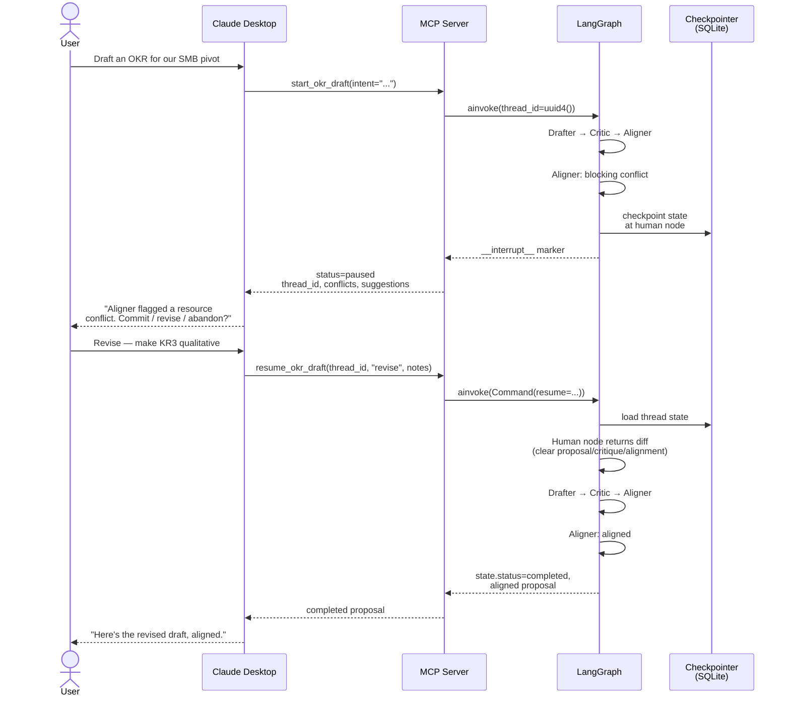
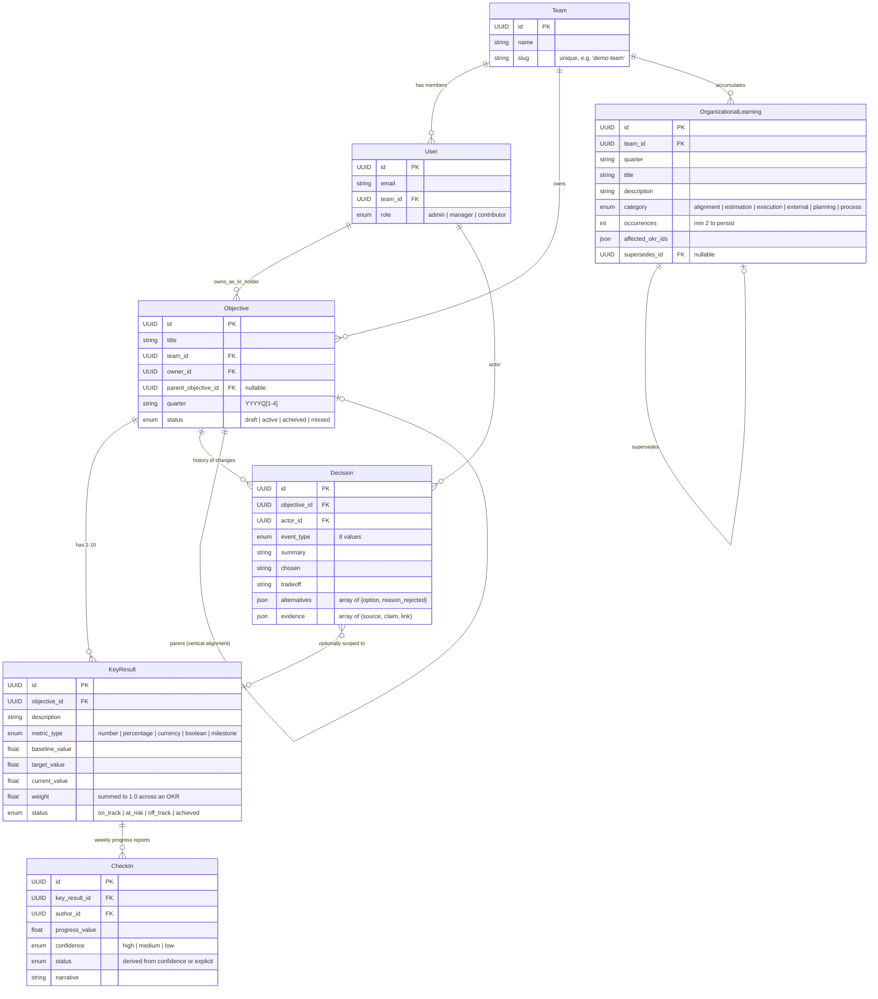
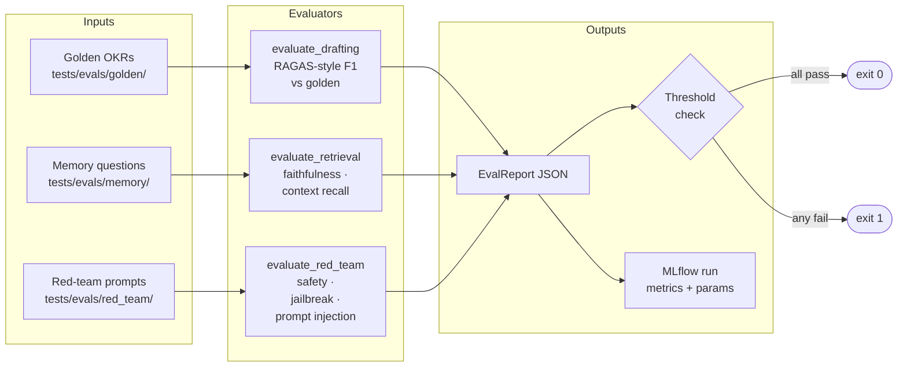
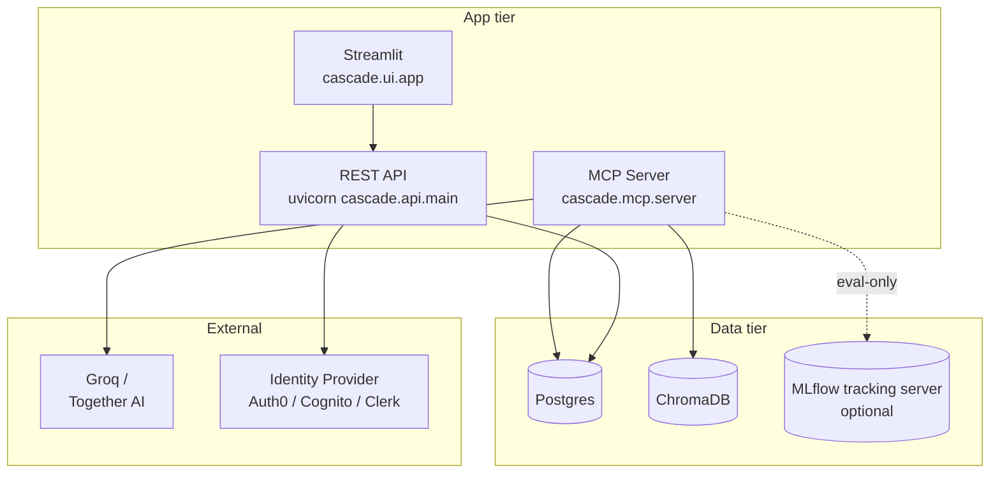

# Architecture

A pragmatic walk through cascade — what it does, how the pieces fit, and the
design choices worth flagging. Top-level synthesis; links into
[`docs/architecture/`](docs/architecture/) for component-level depth and
[`docs/adr/`](docs/adr/) for individual decisions.

**Read in 30 seconds:** scan the [system diagram](#system) and the
[three surfaces table](#surfaces).
**Read in 2 minutes:** add the [agent topology](#agents) and the
[HITL flow](#hitl).
**Read in 10 minutes:** the rest.

## What cascade is

A platform for running OKRs with multi-agent AI assistance and a queryable
causal trail. Three things distinguish it from a generic LLM wrapper:

1. **Agents that disagree.** Drafter proposes, Critic rejects vague language,
   Aligner blocks resource conflicts, Risk Sentinel flags stalling KRs.
   The graph routes between them until consensus or a paused state for a
   human.
2. **Pause-and-resume drafting.** When agents can't agree, the run pauses
   at a `LangGraph.interrupt()` marker. A human chooses commit / revise /
   abandon; the graph continues from where it stopped, no replay.
3. **Decisions as first-class records.** Every state change persists as a
   `Decision` row carrying alternatives considered, the chosen path, and
   the tradeoff accepted. "Why was this target lowered last quarter?" is a
   query, not an archaeology project.

## <a id="system"></a>System

Three integration surfaces, one orchestrator, one storage substrate.

```mermaid
flowchart TB
    subgraph Clients
        Claude[Claude Desktop / Cursor<br/>MCP-aware]
        Browser[Browser /<br/>HTTP clients / CI]
        Console[Streamlit Console<br/>operators]
    end

    subgraph Surfaces
        MCP[MCP Server<br/>FastMCP · 10 tools<br/>HITL state machine]
        REST[REST API<br/>FastAPI · OpenAPI<br/>read + write]
        UI[Operator UI<br/>Streamlit<br/>read-only viewer]
    end

    subgraph Orchestrator
        Graph[LangGraph<br/>Supervisor + 6 agents<br/>HITL via interrupt&#40;&#41;]
        Eval[Eval Gate<br/>RAGAS · DeepEval · red-team]
    end

    subgraph Storage
        PG[(Postgres<br/>OKRs · Decisions ·<br/>Learnings)]
        Chroma[(ChromaDB<br/>memory<br/>retrieval)]
        Sqlite[(SQLite<br/>checkpointer<br/>HITL state)]
    end

    subgraph Observability
        LS[LangSmith]
        LF[Langfuse]
        ML[MLflow]
    end

    Claude --> MCP
    Browser --> REST
    Console --> REST

    MCP --> Graph
    REST --> Graph
    Graph --> PG
    Graph --> Chroma
    Graph -.checkpoints.-> Sqlite

    Eval --> Graph
    Eval --> ML

    Graph -.traces.-> LS
    Graph -.traces.-> LF
```



The dashed lines are the cross-cutting concerns: checkpointing for HITL state,
observability for traces and cost. None of them are required for the agent
loop to work — turn them off and the system runs unchanged with reduced
visibility.

## <a id="surfaces"></a>Three surfaces

Same domain, three ergonomics:

| Surface | When to reach for it | Reads | Writes |
|---|---|---|---|
| **MCP** | Agent loop drives the interaction. Drafting, alignment, HITL pause-and-resume, mid-life target changes. | Yes | Yes — agent-driven |
| **REST** | Caller already knows the answer. Committing aligned drafts from CI, logging decisions, recording check-ins, querying read views. | Yes | Yes — pure persistence |
| **Console** | Humans browsing. List of OKRs, decision trails, learning themes. | Yes | No (Phase 2) |

The split is **usage-pattern, not layer**. Both REST POSTs and MCP tools call
the same domain repositories. The boundary is "REST when the caller knows the
answer, MCP when the agent does." See [`cascade/api/README.md`](cascade/api/README.md)
for the rationale.

## <a id="agents"></a>Agent topology

Six agents plus a supervisor, all running under one LangGraph state graph.

```mermaid
flowchart LR
    Start([start_okr_draft])
    Sup{Supervisor}
    Drafter[Drafter<br/>SMART proposal]
    Critic[Critic<br/>specificity ·<br/>measurability ·<br/>ambition]
    Aligner[Aligner<br/>vertical + horizontal<br/>conflict detection]
    Coach[Coach<br/>check-in narrative<br/>synthesis]
    Risk[Risk Sentinel<br/>velocity stall<br/>detection]
    Reflector[Reflector<br/>cross-OKR pattern<br/>extraction]
    Human[Human<br/>interrupt&#40;&#41;]
    End([END])

    Start --> Sup
    Sup -->|proposal=null| Drafter
    Drafter --> Sup
    Sup -->|critique=needs review| Critic
    Critic --> Sup
    Sup -->|critique=fundamental_reject<br/>or iter cap| Human
    Sup -->|alignment=null| Aligner
    Aligner --> Sup
    Sup -->|alignment=blocked| Human
    Sup -->|alignment=aligned| End
    Human -->|commit / revise / abandon| Sup

    Coach -.invoked by.- Sup
    Risk -.invoked by.- Sup
    Reflector -.invoked by.- Sup
```



Coach, Risk Sentinel, and Reflector run on different entry tools (`log_checkin`,
`assess_risk`, organizational learning extraction) — they share the same model
factory but aren't part of the drafting loop.

The **supervisor** is a conditional edge function, not a node. Its decision
table:

| State | Route to |
|---|---|
| `awaiting_human` is set (any value) | END |
| `proposal` is null | Drafter |
| `critique` is null | Critic |
| `critique.verdict == "fundamental_reject"` | Human |
| `iteration_count >= MAX` | Human |
| `alignment` is null | Aligner |
| `alignment.verdict == "blocked"` | Human |
| `alignment.verdict == "aligned"` | END |

The "awaiting_human as terminal signal" rule (first line) is what makes the
HITL flow actually terminate on `abandon` — see [ADR-0001](docs/adr/0001-langgraph-orchestration.md)
and the v0.13.0 release notes for the full story.

## <a id="hitl"></a>Human-in-the-loop drafting

The most distinctive flow. A user asks Claude Desktop to draft an OKR; the
graph runs Drafter → Critic → Aligner; if the Aligner blocks (resource
conflict with a peer OKR, vertical drift from the parent), the run pauses at
the human node, the user decides what to do, the graph resumes.



Three resumption decisions, three semantics:

| Decision | What it does to state |
|---|---|
| `commit` | Force `alignment.verdict = aligned`, demote blocking conflicts to info, clear `awaiting_human`. Supervisor falls through to END. |
| `revise` | Clear proposal / critique / alignment, clear `awaiting_human`. Supervisor sees null proposal, routes to Drafter; the loop runs again and may pause again. |
| `abandon` | Set `alignment.verdict = blocked` with an audit conflict carrying the abandonment notes. Set `awaiting_human` to `HumanInterrupt(reason="abandoned")`. Supervisor's first rule fires → END. |

The `revise` path can pause again on the next Aligner check, in which case the
client gets the same response shape with the same `thread_id` and just keeps
calling `resume_okr_draft` until the response is `completed`.

## Data model



Two design choices worth noting:

- **`Decision` is append-only.** Editing a decision after the fact would
  destroy the audit trail's value. Corrections happen by appending a new
  Decision that supersedes the old one in narrative; the old row stays.
- **`OrganizationalLearning` uses `supersedes_id` for evolution.** A team's
  learning about CSM adoption friction in 2026Q1 might be refined in 2026Q2;
  the new row links to the old via `supersedes_id`, the old stays queryable
  as the history. Same pattern, different table.

See [ADR-0002](docs/adr/0002-causal-memory-graph.md) for why this is structured
Postgres rather than free-text or vector storage.

## Causal memory

The decision trail is queryable along three axes that real OKR-governance
questions ask:

| Question | Query |
|---|---|
| "Why was this lowered last quarter?" | `Decision` rows for objective_id, filtered by `event_type=kr_target_change` |
| "What's our team's pattern across quarters?" | `OrganizationalLearning` rows for team_id, grouped by category |
| "What did we learn from the 2025Q4 retro?" | `OrganizationalLearning.where(quarter='2025Q4')` |

Free-text retrieval over the decision trail uses BM25 + a cross-encoder
re-ranker. The retrieval pipeline is in [`docs/architecture/memory.md`](docs/architecture/memory.md);
key choice is that the structured rows are the source of truth and
ChromaDB is just an index — the cascade can rebuild ChromaDB from Postgres
at any time without data loss.

## Eval gate

A separate process runs three evaluator suites against fakes or real models
and gates merges on threshold violations.



Thresholds are [config-versioned](cascade/evals/thresholds.yaml). When MLflow
is configured, every run lands as one experiment row with metrics, params,
and tags — the eval gate's history becomes a chartable time series instead
of a stack of JSON files. See [v0.15.0 release notes](CHANGELOG.md#0150---2026-05-06)
for the metric schema.

## Cross-cutting concerns

### Authentication

JWT verification via JWKS. Provider-agnostic — Auth0, AWS Cognito, Clerk,
Keycloak, Azure AD all work without code changes (env-var configuration
only). Three failure shapes mapped to HTTP responses: misconfiguration →
503, JWKS unreachable → 503, verification failed → 401 with a generic
detail (defeats oracle-style probing). See
[`docs/runbooks/jwt-auth.md`](docs/runbooks/jwt-auth.md).

### Observability

Three opt-in integrations sharing one fail-quiet contract:

- **LangSmith** for trace exploration. Activates via env-var detection
  inside LangChain itself.
- **Langfuse** for traces plus cost tracking via token-pricing tables.
  Activated by an explicit `CallbackHandler` attached to the chat model.
- **MLflow** for eval-run experiment tracking.

Every integration catches construction failures and mid-run errors, logs at
WARNING/ERROR, and degrades to no-op. Observability outages must never
propagate to the user. See
[`docs/runbooks/observability.md`](docs/runbooks/observability.md).

### Configuration

A single `Settings` class (Pydantic Settings) reads from environment and
`.env`. All secrets are `SecretStr` so they don't leak through `repr` or
default serialisation. Production defaults err toward "off" for anything
external (MLflow URI defaults to `None`, JWKS URL has no default). See
[`cascade/config.py`](cascade/config.py).

### Storage

Three datastores, each picked for what it's best at:

- **Postgres** for OKRs, Decisions, OrganizationalLearnings, Teams, Users,
  CheckIns. ACID transactions, foreign-key integrity, structured queries.
- **ChromaDB** for memory retrieval (index over Decision summaries plus
  OrganizationalLearning descriptions). The cascade can rebuild it from
  Postgres at any time.
- **SQLite** for the LangGraph checkpointer. Local file (or `:memory:`).
  Cheap to provision per-environment; survives restarts when configured.

## Deployment shape

Three Python processes, one Postgres, one ChromaDB, optional MLflow:



Local-dev runs all three app processes on one host; production deploys them
as three pods (or three services on one VM). The processes are stateless —
all state lives in the data tier. Helm chart is on the roadmap for v0.17.0.

## Decision log

Architecture decisions worth their own write-up:

- [ADR-0001 — LangGraph for orchestration](docs/adr/0001-langgraph-orchestration.md):
  why a state graph rather than a tool-calling loop, and the trade-offs
  with explicit supervisor logic.
- [ADR-0002 — Causal memory as structured Postgres](docs/adr/0002-causal-memory-graph.md):
  why structured Decision rows beat free-text and vector-only stores for
  the questions OKR governance actually asks.
- [ADR-0003 — Dynamic context construction](docs/adr/0003-dynamic-context-construction.md):
  how each agent's context window is built per-call from the relevant
  slice of state, rather than dumping all state into every prompt.

Per-component depth (links repeated for the deep readers):

- [Agents](docs/architecture/agents.md) — six agents in detail
- [Memory](docs/architecture/memory.md) — retrieval pipeline + the
  organizational learning lifecycle
- [Evals](docs/architecture/evals.md) — what each evaluator measures
- [Observability](docs/architecture/observability.md) — instrumentation
  internals
- [Overview](docs/architecture/overview.md) — the ASCII-art version of
  this document, kept for terminal readers

## Code organisation

```
cascade/
├── agents/          6 agent modules + chat-model factory + contracts
├── api/             FastAPI app + JWT verifier + 4 read + 4 mutation routes
├── domain/          Pydantic types: Objective, KeyResult, Decision, ...
├── evals/           Eval gate, evaluators, thresholds.yaml
├── mcp/             FastMCP server + 10 tools + adapters
├── memory/          ChromaDB index + BM25 + cross-encoder re-ranker
├── observability/   LangSmith / Langfuse / MLflow factory + runner
├── orchestrator/    LangGraph + supervisor + resumption helpers
├── scripts/         seed_demo + demo_data
├── storage/         SQLAlchemy models + repositories + migrations
└── ui/              Streamlit operator console
```

Tests in `tests/unit/` and `tests/integration/` mirror this structure. The
test count badge on the README is the live count.
